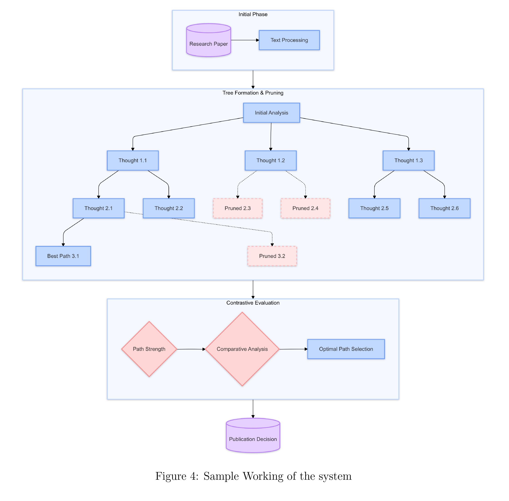
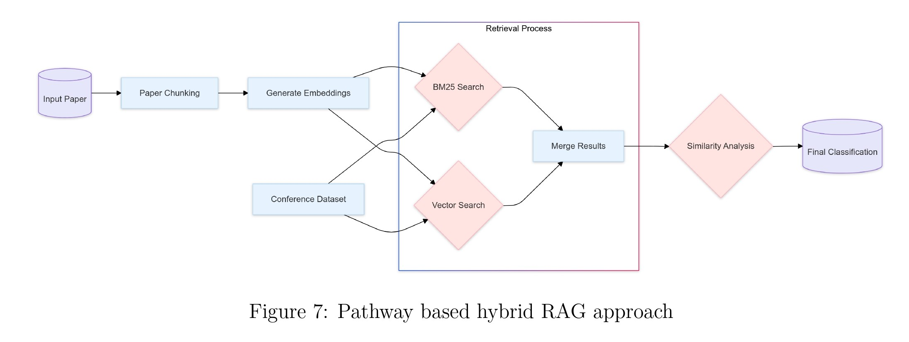
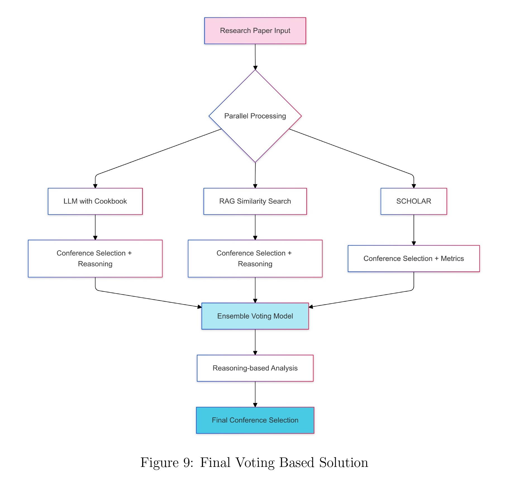

# ARC2: Agentic AI Research Review and Conference Classification

<p align="center">
  
  
  
</p>

<p align="center">
  
</p>

**ARC2 (Agentic AI Research Review and Conference Classification)** is a sophisticated AI paper reviewer designed to act as both a pre-submission shield and a strategic guide for researchers. It leverages agentic frameworks, advanced Retrieval-Augmented Generation (RAG), and the real-time power of the Pathway ecosystem to systematically analyze, critique, and reason about academic papers.

### Demos and Resources
- **Demo Videos**:
  - [ARC2 Architecture + Demo video](https://www.youtube.com/watch?v=0X3H65sBCsg)
  - [ARC2 Demo video | AI Paper Reviewer and Conference Recommender | Pathway Realtime & Live Systems](https://www.youtube.com/watch?v=tJkuu838Rn8)
  - [User Walkthrough: Live AI for Conference Classification and paper publishability prediction](https://youtu.be/8iiFVyNmkCY)
- **Blog Post**: [Building an AI Paper Reviewer with Agentic RAG](https://pathway.com/blog/ai-paper-reviewer/)
- **Technical Report**: [ARC2.pdf](https://drive.google.com/file/d/1RgvO5TzbvvSahGFKQPu8nVA5Mr__oLeQ/view?usp=sharing)

---

## 📖 Table of Contents

- [Introduction](#-introduction)
- [Features](#-features)
- [Architecture](#-architecture)
  - [TACC: Verifiable Publishability Assessment](#tacc-verifiable-publishability-assessment)
  - [SCRIBE: High-Precision Conference Matching](#scribe-high-precision-conference-matching)
- [Technical Deep Dive](#-technical-deep-dive)
  - [The `embedder` Service](#the-embedder-service)
  - [The `indexer` Service](#the-indexer-service)
  - [The `agent` Service](#the-agent-service)
- [System Components](#-system-components)
- [Setup and Execution](#-setup-and-execution)
- [Performance](#-performance)
- [Future Horizons](#-future-horizons)
- [Authors](#-authors)
- [References](#-references)

---

## 🚀 Introduction

Every researcher knows the feeling: the mix of hope and anxiety that comes with submitting a manuscript to the unforgiving gauntlet of peer review. Looming in every scientist's mind is the specter of the ferocious "Reviewer 2"—the notoriously critical, often inscrutable gatekeeper who can make or break a publication. What if you had an expert assistant who could polish your paper and preempt that criticism before it ever happens?

But even before facing that human judgment, a second, equally daunting hurdle exists: conference classification. Submitting a brilliant computer vision paper to a natural language processing conference is a recipe for instant desk rejection. Choosing a venue that is a poor fit means your work might get lost in a sea of irrelevant submissions, failing to reach the audience that matters most.

These twin challenges—ensuring publishability and finding the perfect venue—are not simple classification problems. They demand a deep, nuanced understanding of scientific argumentation, methodological rigor, and the distinct identities of academic communities.

This led us to ask a frontier question in computational reasoning: Could we engineer an AI system that doesn't just categorize papers, but systematically analyzes, critiques, and reasons like an expert reviewer?

This is the technical deep dive into how we built that system. We call it **ARC2 (Agentic AI Research Review and Conference Classification)**, a sophisticated AI paper reviewer designed to act as both a pre-submission shield and a strategic guide. It is the story of our architectural decisions, our iterative engineering process, and how we leveraged agentic frameworks, advanced RAG, and the real-time power of the Pathway ecosystem to build a solution.

## ✨ Features

- **Verifiable Publishability Assessment**: A "glass box" system that provides transparent, auditable, and structurally sound reasoning for its publishability predictions, achieving 92% accuracy on real-world data.
- **High-Precision Conference Matching**: An ensemble-based architecture that navigates conference nuances, thematic overlaps, and data imbalances to recommend the most suitable venue for a research paper.
- **Real-Time Analysis**: Built on a streaming architecture, every new revision or pre-print is re-indexed on the fly, providing live, data-backed confidence.
- **Agentic Frameworks**: Utilizes advanced AI paradigms like Tree of Thoughts (ToT) and Actor-Critic models for sophisticated, multi-step reasoning.

## 🏗️ Architecture

### TACC: Verifiable Publishability Assessment

Our first objective was to determine a paper's publishability. While a basic LLM prompt can achieve reasonable accuracy, it functions as an opaque "black box," providing an answer without a verifiable line of reasoning. For a task that demands trust and justification, this is a non-starter. Our core motivation was to construct a "glass box" , a system whose decision-making process is transparent, auditable, and structurally sound.

**TACC (ToT Actor-Contrastive CoT Critic)** is a dual-LLM system engineered for hierarchical, multi-step reasoning. It integrates several advanced AI paradigms to create an evaluation engine that is both accurate and interpretable.

- **Tree of Thoughts (ToT)**: TACC explores multiple analytical branches in parallel, mimicking the divergent thinking process of a human expert to build a comprehensive understanding of the paper's quality. This is managed in [`agent/services/tree_of_thoughts.py`](agent/services/tree_of_thoughts.py:1).
- **Contrastive Chain-of-Thought (CoT) Critic**: The Critic compares parallel thought branches against each other to intelligently prune weaker lines of inquiry, focusing computational resources on the most promising paths.
- **Asynchronous Dual-LLM Dynamic**: The system uses `gpt-4o-mini` as a fast Actor for breadth and `gpt-4o` as a powerful Critic for depth. Implemented with Python's `asyncio` in [`agent/services/paper_evaluator.py`](agent/services/paper_evaluator.py:1), this allows for concurrent processing and high performance.

<p align="center">
  
</p>

### SCRIBE: High-Precision Conference Matching

Conferences have thematic overlaps and severe data imbalances. A simple classifier would be hopelessly biased. **SCRIBE (Semantic Conference Recommendation with Intelligent Balanced Evaluation)** is our solution—a multi-agent ensemble where three specialized AI agents independently analyze a paper and "vote" on the best conference.

- **Agent 1: The "Cookbook" LLM**: Uses a meticulously curated knowledge base to understand the unique academic identity of each conference. Implemented in [`agent/services/llm_based_classifier.py`](agent/services/llm_based_classifier.py:1).
  <p align="center">
    
  </p>
- **Agent 2: The Pathway RAG Agent**: Grounded in historical data, this agent uses Pathway’s real-time data ingestion and advanced hybrid retrieval to provide data-driven recommendations. The RAG agent itself is in [`agent/services/rag_based_classifier.py`](agent/services/rag_based_classifier.py:1).
  <p align="center">
    
  </p>
- **Agent 3: The SCHOLAR Agent**: Taps into the global academic research landscape via the Semantic Scholar API, using hierarchical query generation and a logarithmic scoring function to overcome data imbalance. Implemented in [`agent/services/similarity_based_classifier.py`](agent/services/similarity_based_classifier.py:1).
  <p align="center">
    
  </p>
- **Ensemble Controller**: The [`FinalClassifier`](agent/services/final_classifier.py:37) analyzes the outputs from all three agents to make a reasoned final decision.
  <p align="center">
    
  </p>

<!-- <p align="center">
  
</p> -->

## 🔬 Technical Deep Dive

This section provides a more detailed look into the implementation of each service.

### The `embedder` Service

The `embedder` service is a lean, high-performance microservice responsible for one thing: generating high-quality sentence embeddings.

- **Core Technology**: Deployed on **[Modal](https://modal.com/)**, a serverless platform that provides on-demand GPU access. This ensures scalability and cost-efficiency.
- **Implementation (`embedder/modal_service.py`)**:
    - The [`Model` class](embedder/modal_service.py:41) is the heart of the service. The `@modal.enter()` decorator loads the `dunzhang/stella_en_1.5B_v5` model from a persistent `modal.Volume` into GPU memory on startup. This avoids the cold-start problem of reloading the large model on every request.
    - The [`inference` method](embedder/modal_service.py:56) is exposed as a Modal endpoint. It takes a string of text and returns the corresponding embedding vector.
    - The service is exposed via a FastAPI application, with an `/embeddings` endpoint that invokes the `inference` method.

### The `indexer` Service

The `indexer` service is the data backbone of the SCRIBE RAG agent. It builds and maintains a sophisticated, real-time search index.

- **Core Technology**: Built with **[Pathway](https://pathway.com/)**, a framework for high-throughput, low-latency data processing on streaming data.
- **Implementation (`indexer/services/indexer.py` and `document_store.py`)**:
    - **Data Ingestion**: The [`DriveConnector`](indexer/services/drive_connector.py) is responsible for connecting to a Google Drive folder and ingesting research papers.
    - **Indexing Pipeline**: The [`Indexer` class](indexer/services/indexer.py:13) orchestrates the indexing process.
    - **Hybrid Search**: The [`DocumentStoreServerWrapper`](indexer/services/document_store.py:38) configures a `DocumentStore` with a hybrid retrieval strategy. This is the key to the RAG agent's performance. It combines two retrieval methods:
        1.  **Lexical Search**: [`TantivyBM25Factory`](indexer/services/document_store.py:112) provides a BM25 index for efficient keyword-based search.
        2.  **Semantic Search**: [`UsearchKnnFactory`](indexer/services/document_store.py:98) provides a k-Nearest Neighbors index for finding semantically similar vectors.
    - The `create_server` method in [`DocumentStoreServerWrapper`](indexer/services/document_store.py:73) brings it all together, creating a `HybridIndexFactory` that powers the document store.

### The `agent` Service

The `agent` service is the central reasoning engine of ARC2. It exposes the TACC and SCRIBE functionalities through a FastAPI API.

- **API (`agent/api/main.py`)**:
    - Defines `/evaluate/{pdf,text}` and `/classify/{pdf,text}` endpoints.
    - It uses a `ThreadPoolExecutor` to run the CPU-bound and I/O-bound evaluation and classification tasks in the background, preventing the API from blocking.
- **TACC Implementation**:
    - [`PaperEvaluator`](agent/services/paper_evaluator.py:77): This class orchestrates the entire publishability assessment. Its `evaluate_paper` method drives the ToT process.
    - [`TreeOfThoughts`](agent/services/tree_of_thoughts.py:249): This class implements the core ToT logic.
        - `generate_thoughts`: The "Actor" LLM (`gpt-4o-mini`) generates multiple potential reasoning steps (thoughts) in parallel.
        - `evaluate_level`: The "Critic" LLM (`gpt-4o`) evaluates the generated thoughts using a contrastive prompt, selecting the best path and pruning weaker ones.
- **SCRIBE Implementation**:
    - [`LLMBasedClassifier`](agent/services/llm_based_classifier.py:41): A "Cookbook" agent that uses a detailed system prompt to classify the paper based on a curated knowledge base of conference characteristics.
    - [`RagBasedClassifier`](agent/services/rag_based_classifier.py:18): This agent queries the `indexer` service to retrieve relevant paper chunks and uses an LLM to classify the paper based on this retrieved context.
    - [`SimilarityBasedClassifier`](agent/services/similarity_based_classifier.py:43): This agent queries the Semantic Scholar API, retrieves abstracts of similar papers, and uses their publication venues to inform its decision. It employs a logarithmic scoring function to handle data imbalances.
    - [`FinalClassifier`](agent/services/final_classifier.py:37): This class acts as the ensemble controller. It invokes the three classifiers in parallel using `asyncio.gather`, and then uses a final LLM call to synthesize their outputs into a single, well-reasoned recommendation.

## 🧩 System Components

The project is divided into four main components:

- **`embedder/`**: A Modal-based service responsible for generating sentence embeddings using the `dunzhang/stella_en_1.5B_v5` model.
- **`indexer/`**: A Pathway-based service that handles the indexing of embeddings for efficient storage and retrieval. It uses the Pathway Drive connector and Document Store for hybrid retrieval (BM25 + USearchKNN).
- **`agent/`**: The core reasoning engine containing the TACC and SCRIBE implementations. It provides a FastAPI interface for evaluating and classifying research papers.
- **`ksdh-webapp/`**: A Next.js T3 stack web application that provides a user interface for the services.

## 📁 Directory Structure

```
.
├── agent/                  # Core reasoning engine (TACC and SCRIBE)
│   ├── api/                # FastAPI application
│   ├── models/             # Pydantic schemas and configurations
│   ├── services/           # TACC and SCRIBE implementation logic
│   └── utils/              # Utility functions
├── architecture-diagrams/  # Project architecture diagrams (including the demo GIF)
├── embedder/               # Modal-based sentence embedding service
├── indexer/                # Pathway-based indexing service
│   ├── services/           # Indexing and document store logic
│   └── utils/              # Utility functions
├── ksdh-webapp/            # Next.js frontend application
├── LICENSE                 # MIT License
└── README.md               # This file
```

## ⚙️ Setup and Execution

### Prerequisites

- Python 3.11+
- Poetry
- Modal
- Docker
- Node.js and npm

### 1. Embedder Service

The embedder service is deployed on Modal.

1.  Navigate to the `embedder` directory:
    ```bash
    cd embedder
    ```
2.  Install dependencies:
    ```bash
    poetry install
    ```
3.  Run the embedder service on Modal:
    ```bash
    poetry run modal run modal_service.py
    ```
    *Note: The first run will take longer as it needs to save the model to a Modal Volume.*

### 2. Indexer Service

The indexer service creates a vector store of research papers.

1.  Navigate to the `indexer` directory:
    ```bash
    cd indexer
    ```
2.  Install dependencies:
    ```bash
    poetry install
    ```
3.  Set up your Google Drive folder with reference papers and create a `.env` file with the link. See [`config.py`](indexer/config.py) for details.
4.  Run the indexer service:
    ```bash
    poetry run python services/indexer.py
    ```

### 3. Agent Service

The agent service provides the main API for paper analysis.

1.  Navigate to the `agent` directory:
    ```bash
    cd agent
    ```
2.  Install dependencies:
    ```bash
    poetry install
    ```
3.  Create a `.env` file with your API keys (OpenAI, Groq, etc.).
4.  Run the agent service:
    ```bash
    poetry run uvicorn api.main:app --host 0.0.0.0 --port 8000 --reload
    ```

### 4. Web Application

The web application provides a user-friendly interface.

1.  Navigate to the `ksdh-webapp` directory:
    ```bash
    cd ksdh-webapp
    ```
2.  Install dependencies:
    ```bash
    npm install
    ```
3.  Run the development server:
    ```bash
    npm run dev
    ```
4.  Open [http://localhost:3000](http://localhost:3000) in your browser.

## 📊 Performance

### Task 1: Publishability Assessment

| Metric      | Score (15 Sample Papers) | Score (135 Unlabeled Papers) |
| :---------- | :----------------------- | :--------------------------- |
| Accuracy    | 1.0                      | 0.91                         |
| F1 Score    | 1.0                      | 0.96                         |
| Precision   | 1.0                      | 0.93                         |
| Recall      | 1.0                      | 1.00                         |

### Task 2: Conference Recommendation

**Overall Metrics:**

| Metric                | Value |
| :-------------------- | :---- |
| Accuracy              | 0.900 |
| Macro-Average F1-Score| 0.905 |

**Per-Class Metrics:**

| Conference | Precision | Recall | F1-Score |
| :--------- | :-------- | :----- | :------- |
| CVPR       | 1.000     | 1.000  | 1.000    |
| EMNLP      | 1.000     | 1.000  | 1.000    |
| KDD        | 1.000     | 1.000  | 1.000    |
| NeurIPS    | 0.750     | 1.000  | 0.857    |
| TMLR       | 1.000     | 0.500  | 0.667    |

## 🚀 Future Horizons

- **Next-Generation Models**: The architecture is model-agnostic. Integrating newer, more powerful reasoning models (like `gemini-2.5-pro`, `o3`, `o4-mini-high`, and `claude 4 sonnet`) is a direct path to higher performance.
- **Hyperscale Inference**: Emerging hardware like Cerebras's Wafer-Scale Engines could enable near-instantaneous analysis of entire research libraries.
- **Automated System Tuning**: A meta-learning layer using reinforcement learning could dynamically tune system parameters like the pruning threshold in TACC or the voting weights in SCRIBE, creating a self-improving system.

## ✍️ Authors

- **Divyansh Sharma**: [LinkedIn](https://www.linkedin.com/in/divyanshsharma-/)
- **Tasmay Pankaj Tibrewal**: [LinkedIn](https://www.linkedin.com/in/tasmay-tibrewal/)
- **Tanush Agarwal**: [LinkedIn](https://www.linkedin.com/in/tanush-agarwal-83893727a/)
- **Shashwat Singh Ranka**: [LinkedIn](https://www.linkedin.com/in/shashwat-singh-ranka-7a168a259/)

## 📚 References

- [Original Technical Report: ARC2.pdf](https://drive.google.com/file/d/1RgvO5TzbvvSahGFKQPu8nVA5Mr__oLeQ/view?usp=sharing)
- [Pathway Developer Documentation](https://pathway.com/developers/docs/)
- [Pathway's Ready-to-run App Templates](https://github.com/pathway-labs/app-templates)
- [End-to-end Real-time RAG app with Pathway](https://github.com/pathway-labs/pathway-and-llms)
- [Pathway Discord Community](https://discord.gg/pathway)
