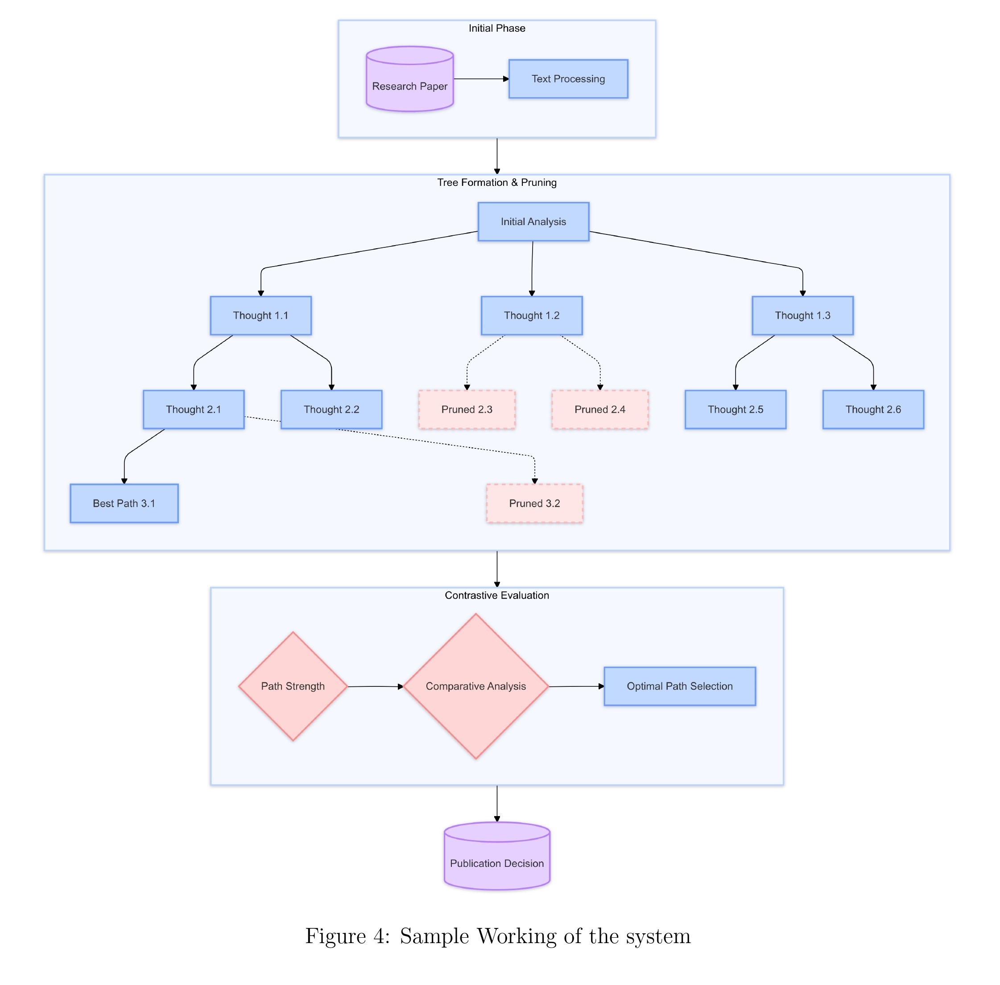
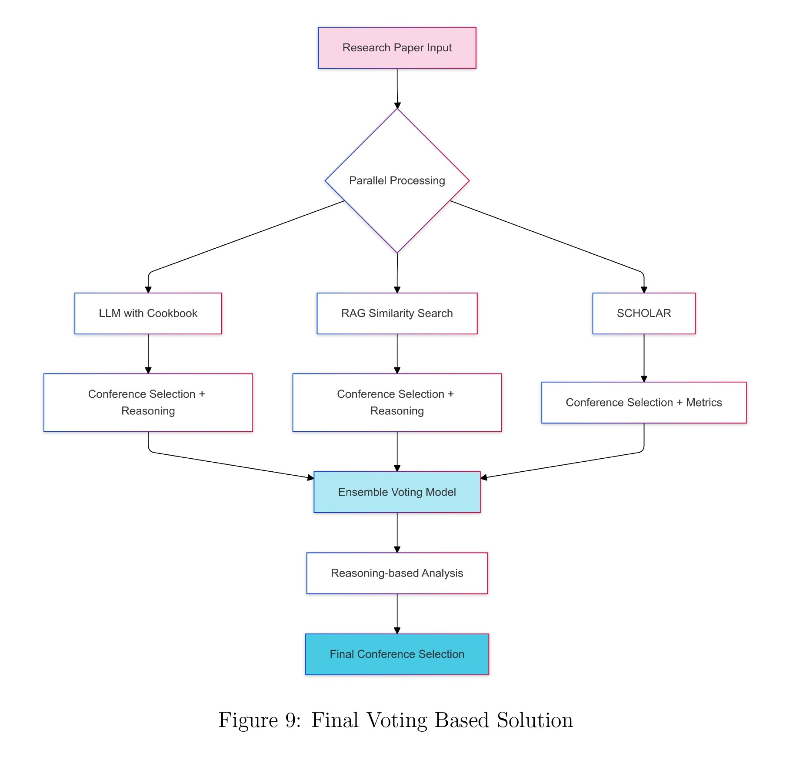
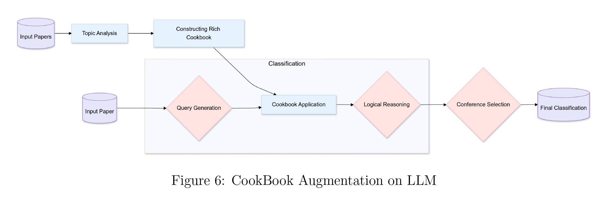
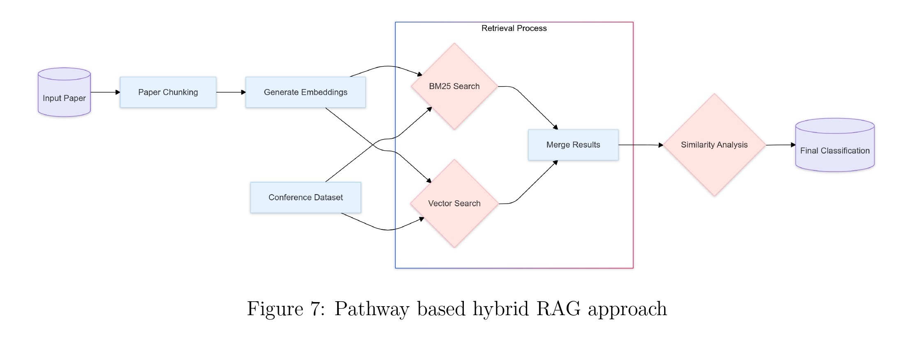
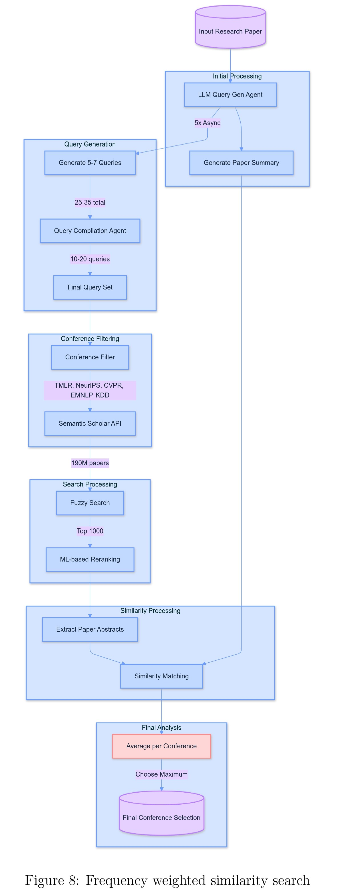

# ARC2 Agent Service

This directory contains the core reasoning engine for the **ARC2 (Agentic AI Research Review and Conference Classification)** project. It provides a FastAPI-based service that exposes endpoints for evaluating research papers.

## 🚀 Overview

The agent service is the brain of the ARC2 system. It orchestrates a series of complex, agentic workflows to perform two primary tasks:

1.  **Publishability Assessment**: Using the **TACC (ToT Actor-Contrastive CoT Critic)** architecture, the service performs a deep, multi-faceted analysis of a paper's content to determine its publishability.
2.  **Conference Classification**: Using the **SCRIBE (Semantic Conference Recommendation with Intelligent Balanced Evaluation)** architecture, the service recommends the most suitable academic conference for the paper from a predefined list (CVPR, EMNLP, KDD, NeurIPS, TMLR).

## 🛠️ Tech Stack

-   Python 3.11
-   [FastAPI](https://fastapi.tiangolo.com/)
-   [LangChain](https://www.langchain.com/)
-   [Pydantic](https://pydantic-docs.helpmanual.io/)
-   [OpenAI & Groq APIs](https://openai.com/)

## ⚙️ Setup and Execution

### Prerequisites

-   Python 3.11+
-   Poetry
-   Access to the [Embedder Service](../embedder/README.md) and [Indexer Service](../indexer/README.md).
-   API keys for required LLM providers (e.g., OpenAI, Groq).

### Installation

1.  Navigate to the `agent` directory:
    ```bash
    cd agent
    ```
2.  Install dependencies using Poetry:
    ```bash
    poetry install
    ```
3.  Create a `.env` file in the `agent` directory and add your API keys. You can use the `.env.example` as a template.
    ```env
    OPENAI_API_KEY="your-openai-api-key"
    GROQ_API_KEY="your-groq-api-key"
    # Add other required keys
    ```

### Running the Service

To run the agent service, use the following command from the `agent` directory:

```bash
poetry run uvicorn api.main:app --host 0.0.0.0 --port 8000 --reload
```

The API documentation will be available at [http://localhost:8000/docs](http://localhost:8000/docs).

## 🏛️ Architecture Deep Dive

### FastAPI Application

The file [`api/main.py`](api/main.py:1) defines the web service.
- **Endpoints**: It exposes four main endpoints:
    - `POST /evaluate/pdf`: Evaluates the publishability of a paper from a PDF file.
    - `POST /evaluate/text`: Evaluates the publishability of a paper from raw text.
    - `POST /classify/pdf`: Recommends a conference for a paper from a PDF file.
    - `POST /classify/text`: Recommends a conference for a paper from raw text.
- **Asynchronous Processing**: To handle potentially long-running evaluation and classification tasks without blocking the server, the API uses a `ThreadPoolExecutor`. Each request is run in a separate thread, allowing for concurrent processing.

### TACC (ToT Actor-Contrastive CoT Critic)

The TACC architecture is designed for transparent and verifiable reasoning.
<p align="center">
  
</p>

- **[`PaperEvaluator`](agent/services/paper_evaluator.py:77)**: This is the main class that orchestrates the evaluation. Its `evaluate_paper` method iteratively builds the reasoning tree.
- **[`TreeOfThoughts`](agent/services/tree_of_thoughts.py:249)**: This class contains the core logic for the Tree of Thoughts framework.
    - **`generate_thoughts`**: This method acts as the **Actor**. It uses a faster, smaller LLM (`gpt-4o-mini`) to generate multiple potential reasoning steps (thoughts) based on the current analysis path. This allows for broad exploration of different analytical directions.
    - **`evaluate_level`**: This method acts as the **Critic**. It uses a more powerful LLM (`gpt-4o`) to evaluate the thoughts generated by the Actor. It receives all parallel reasoning paths and uses a contrastive prompt to compare them, selecting the most promising path to continue and pruning the weaker ones. This ensures that the reasoning process stays focused and efficient.
- **[`ThoughtNode`](agent/services/tree_of_thoughts.py:40)**: A simple data class representing a single node in the reasoning tree, containing the thought's content, the aspect it analyzes, and its relationship to other nodes.

### SCRIBE (Semantic Conference Recommendation with Intelligent Balanced Evaluation)

The SCRIBE architecture is an ensemble of three specialized agents that "vote" on the best conference.
<p align="center">
  
</p>

- **[`LLMBasedClassifier`](agent/services/llm_based_classifier.py:41)**: This agent acts as a "Cookbook" expert. It uses a very detailed system prompt that encodes a knowledge base about the specific focus, scope, and common topics of each target conference. It makes its recommendation based on how well the paper's content aligns with this curated knowledge.
  <p align="center">
    
  </p>
- **[`RagBasedClassifier`](agent/services/rag_based_classifier.py:18)**: This agent provides data-driven recommendations. It takes the paper's content, queries the vector index created by the `indexer` service to find similar papers, and then uses the conference venues of those similar papers to inform its classification.
  <p align="center">
    
  </p>
- **[`SimilarityBasedClassifier`](agent/services/similarity_based_classifier.py:43)**: This agent leverages the vast external knowledge base of Semantic Scholar. It generates multiple search queries from the paper's content, queries the Semantic Scholar API, and retrieves a list of similar papers. It then analyzes the conference venues of the retrieved papers, using a logarithmic scoring function to mitigate the data imbalance often found in academic datasets (e.g., more papers from popular conferences).
  <p align="center">
    
  </p>
- **[`FinalClassifier`](agent/services/final_classifier.py:37)**: This class is the ensemble controller. It receives the outputs from the three classifiers. It then uses a final LLM call to synthesize these diverse inputs, weighing the evidence from the knowledge-based, data-driven, and external-similarity approaches to produce a final, robust recommendation with a detailed rationale. The asynchronous `classify` method runs all three classifiers concurrently for maximum efficiency.